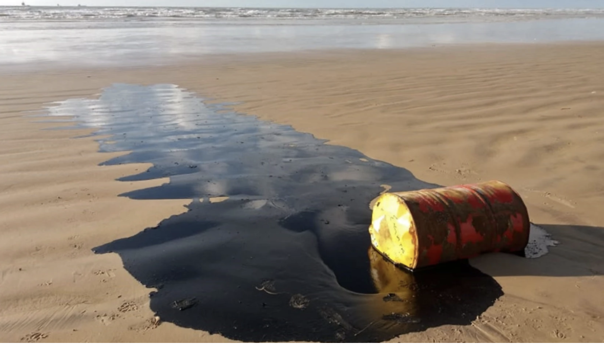

```{r, echo = FALSE, fig.align = 'center'}

```

### Summary:
This post explores how to build a static choropleth map with R and the `ggplot2` package. It shows how to load spatial data into R, merge region features between datasets, and build a finalized map of 2008 counts of inland oil spills in California counties as a fill color gradient. 

I first had issues plotting the oil spills as fill color on the map when I used two separate `geom_sf()` layers, but I realized I could merge the data frame and then use the number column aesthetically as the fill color of the map. In doing this project, I became more familiar with reading in and wrangling spatial data, using the `sf` package functions, and how to use the `viridis` package for color gradients. I also used the `guide` function to update my legend. 

```{r setup, include=FALSE}
knitr::opts_chunk$set(echo = FALSE,
                      message = FALSE,
                      warning = FALSE)
library(tidyverse)
library(here)
library(sf)
library(janitor)
library(dplyr)
library(tmap)
library(viridis)
```

### Finding & Downloading Spatial Data: 

- A choropleth map requires a geospatial dataset to provide the region boundaries, in this example we are looking at California counties. First, I had to find & download a shapefile data for borders of California counties.
- You also need another geospatial dataset with numeric variables for each location that will we use to color the counties. I used download data from CA DFW Oil Spill Incident Tracking [URL](https://gis.data.ca.gov/datasets/7464e3d6f4924b50ad06e5a553d71086_0/data)

First, I loaded the spatial data sets into R using the `read_sf()` function from the `sf` package. I created a folder in my project root named "data" to store all data files & then the oil spatial data files are in a folder labeled "Oil_Spill_Tracking" and the California counties boundary data in a folder labeled "ca_counties". I then use the `here()` function from the `janitor` package to give a clear file path to the shape files. 

```{r}
# Read in the oil spatial data: 
oil_spill_data <- read_sf(here("data","Oil_Spill_Tracking","Oil_Spill_Incident_Tracking_%5Bds394%5D.shp")) %>% 
  clean_names()

# Read in the CA counties data as an entire layer:
ca_counties <- read_sf(here("data","ca_counties"), layer = "CA_Counties_TIGER2016") %>% 
  clean_names() %>% 
  select(name) 
```

Next, I checked the projections, or how the coordinate reference systems are displayed, of the spatial data sets using the `st_crs()` function from the `sf` package. When merging two data sets to make this map, it is important that the projections of both data sets match or you'll encounter difficulties in analysis & mapping. If the datasets have different projections, the `st_transform()` function can be used to transform one spatial data set to match the other, as shown below:

```{r}
#Check the Projections:
# st_crs(oil_spill_data) 
# WGS 84

# st_crs(ca_counties)
# WGS 84

#Set this data set to have the same CRS as above:
ca_counties <- st_transform(ca_counties, st_crs(oil_spill_data))
```

### Data Wrangling of Oil Data:

For this analysis, I specifically plotted the number of inland oil spills per California county in 2008. Therefore, some data wrangling using functions from the `dplyr` package was necessary to get counts per county:

```{r, fig.align = "center"}
# Data Wrangling - count oil spills for ca county:
## Make a subset of data:
inland_subset <- oil_spill_data %>% 
# Rename county for simplification:
  rename(county = localecoun) %>% 
# Only keep observations from inland areas:
  filter(inlandmari == "Inland") %>% 
# Group oil spills by county:
  group_by(county) %>% 
# Count the number of inland oil spills per county:
  count(inlandmari) %>% 
# Remove the inland column for simplification:
  select(-inlandmari)
```

### Merge the spatial data sets:

In order to plot the oil data with the California counties outlines, I merged the data so I could plot the number of oil spills as a fill color gradient in the map

```{r}
# Join the data sets into a single data frame:
counties_oil <- st_join(ca_counties, inland_subset) 
```

### Make a customized chloropleth map with ggplot2:

```{r}
#Make a Static Chloropleth Map:
ggplot() +
  geom_sf(data = counties_oil,
          aes(fill = n),
          size = 0,
          color = "white") +
  scale_fill_viridis(option = "inferno", 
                     breaks = c(50, 100, 150, 200, 250, 300, 350, 400),
                     begin = 0.1, 
                     end = 0.9,
                     guide = guide_legend(keyheight = unit(5, units = "mm"), keywidth=unit(5, units = "mm"))) +
  theme_void() +
  labs(title = "2008 Inland Oil Spill Events Across All California Counties",
       fill = "Number of Oil Spills") +
  theme(
    plot.background = element_rect(fill = "#f5f5f3", color = NA),
    plot.title = element_text(size = 14)
  )
```
