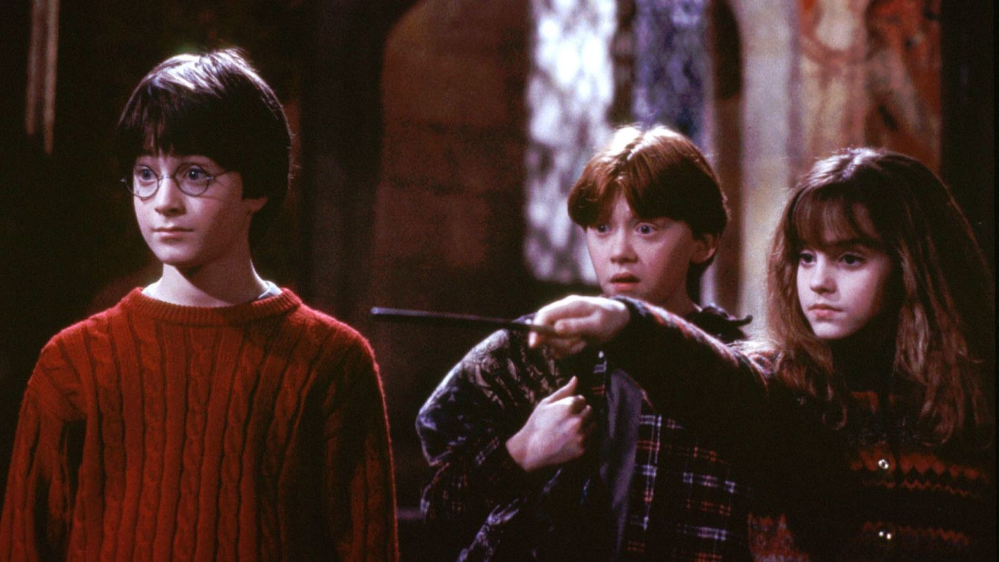

```{r, fig.align='center'}

```

### Summary:
This post explores how to build a word cloud using `ggplot` & conduct sentiment analysis using the `NRC` lexicon. It shows how to load in pdf text data in R, get text data in tidy & tokenized format, and make finalized data visualizations for word frequencies & sentiment in Harry Potter & The Sorcerer's Stone. 

This was my first attempt at text analysis, and I had so much fun wrangling one of my favorite books into cool data visualizations. I became more familiar with using the `stringr` functions, and how to read in and tidy text. I ran into issues with my sentiment analysis plot since the chapter numbers were written out in words instead of as numbers, but I used `mutate(case_when = )` to change them to numbers. I also practiced using `scales = FREE` to tidy up by sentiment data visualization. I also strengthened my skills in `ggplot` using then `theme` function to update the axis text size, and played around with background color in my first data visualization. 

```{r setup, include = FALSE}
knitr::opts_chunk$set(echo = TRUE,
                      message = FALSE,
                      warning = FALSE)
library(tidyverse)
library(here)
library(tidytext)
library(textclean)
library(textdata)
library(pdftools)
library(ggwordcloud)
library(viridis)
```

### Reading in PDF Text Files: 

```{r}
harry_potter_text <- pdf_text(here("data", "harry_potter.pdf"))
```

### Tidying up the Text Data:

First, the text data must be transformed into a data frame using the `data.frame` function. This will make each page of the book into a separate row in the new data set. 
Then I did the following steps to tidy the text data frame:
- Removed the pages before Chapter 1 starts using the `slice()` function
- Removed excess white space using `str_squish` 
- Made a new column for chapter & populated when the row has "CHAPTER" in it & populated with NA for the other rows. Then used `fill()` to populate with the chapter number & used `separate` to separate into the word chapter and the number. 

```{r}
# Make a tidy data subset:
harry_potter_tidy <- data.frame(harry_potter_text) %>% 
# Remove the lines in the data frame before Chapter 1: 
  slice(-(1:6)) %>% 
# Remove excess white spaces: 
  mutate(harry_potter_text = str_squish(harry_potter_text)) %>% 
# Make a new column for chapter - if there is "CHAPTER" in the text column it will add "CHAPTER" to the chapter column and if not it will populate with NA:
  mutate(chapter = case_when(
    str_detect(harry_potter_text, pattern = "CHAPTER") ~ harry_potter_text,
    TRUE ~ NA_character_
  )) %>% 
# Populate the NA values in the chapter column with the chapter number until the next non-NA value:
  fill(chapter) %>% 
# Separate the chapter column into the word chapter and the number: 
  separate(col = chapter, into = c("ch", "number"), sep = " ") %>% 
# Make numbers to lowercase numbers: 
  mutate(number = str_to_lower(number)) %>% 
# Remove un-necessary chapter column: 
  select(number, harry_potter_text) 
```

### Get the Data into Tokenized Text Format: 

Then I use the `unnest_tokens` function to make each word in the book into a separate row, and then used `anti_join()` function to remove stop words:

```{r}
# Get this into tokenized text format:
harry_potter_tokens <- harry_potter_tidy %>% 
  unnest_tokens(word, harry_potter_text) 

# Remove Stop Words:
harry_nostop <- harry_potter_tokens %>% 
  anti_join(stop_words) 
```

### Data Wrangling for Word Frequency Word Cloud:

I chose to make a word cloud of Chapter 15, "The Forbidden Forest", using the 100 most used words in the chapter, so I needed to wrangle the data to get the frequencies of words in the chapter: 

```{r}
#Count words by chapter:
harry_counts <- harry_nostop %>% 
  count(number, word) 

#Find top 100 words in chapter 15:
harry_ch15_top_100 <- harry_counts %>% 
# Only keep words from chapter 15:
  filter(number == "fifteen") %>% 
# Arrange in decending order: 
  arrange(-n) %>% 
# Only keep top 100: 
  slice(1:100)
```

### Make a Word Cloud Using `ggplot`:

```{r, fig.align='center'}
ggplot(data = harry_ch15_top_100, aes(label = word)) +
  geom_text_wordcloud(aes(color = n, size = n)) +
  scale_size_area(max_size = 12) +
  theme_minimal() +
  scale_color_viridis(option = "magma",
                      begin = .4,
                      end = 1) +
  theme(plot.background = element_rect(fill = "gray18",color = NA)) +
  labs(title = "100 Most Used Words in Harry Potter & The Sorcerer's Stone \n Chapter 15: The Forbidden Forest") +
  theme(plot.title = element_text(hjust = 0.5, size = 14, color = "white", face = "bold"))
```

### Data Wrangling for Sentiment Analysis:

I used the `NRC` lexicon for this sentiment analysis, which classifies words into ten emotional bins. First, I had to join the nrc lexicon with my tidy text data set using `inner_join()`. Then, I found counts of how many times the sentiment was reflected by words for each chapter. Since the chapter numbers were written out in words, I used the `mutate()` function to change the words to the number form

```{r}
#Inner join with NRC lexicon:
harry_nrc <- harry_nostop %>% 
  inner_join(get_sentiments("nrc")) 

# Count of times the 10 sentiments are reflected by words in each chapter:
harry_nrc_counts <- harry_nrc %>% 
  mutate(number = case_when(number == "one" ~ "1",
                            number == "two" ~ "2",
                            number == "three" ~ "3",
                            number == "four" ~ "4",
                            number == "five" ~ "5",
                            number == "six" ~ "6",
                            number == "seven" ~ "7",
                            number == "eight" ~ "8",
                            number == "nine" ~ "9",
                            number == "ten" ~ "10",
                            number == "eleven" ~ "11",
                            number == "twelve" ~ "12",
                            number == "thirteen" ~ "13",
                            number == "fourteen" ~ "14",
                            number == "fifteen" ~ "15",
                            number == "sixteen" ~ "16",
                            number == "seventeen" ~ "17",
                            )) %>% 
  count(sentiment, number) 
```

### Sentiment Analysis Data Visualization 
In order to visualize the sentiment throughout the book, I plotted the sentiment counts per chapter using `ggplot` and I used `facet_wrap()` to separate the column graphs into individual graphs for each chapter. 

```{r, fig.align='center'}
#Plot the counts of each of the 10 sentiments - see the emotion per chapter:
ggplot(data = harry_nrc_counts, aes(x = sentiment, y = n)) +
  geom_col(aes(fill = number), show.legend = FALSE) +
  theme_minimal() +
  coord_flip() +
  facet_wrap(~number, scales = "free") +
  labs(title = "Sentiment Analysis by Chapter of Harry Potter & \n The Sorcerer's Stone",
       x = " ", y = " ") +
  theme(plot.title = element_text(hjust = 0.5, size = 15, face = "bold")) +
  theme(axis.text.x = element_text(size = 4, face = "bold")) +
  theme(axis.text.y = element_text(size = 3.5, face = "bold")) +
  theme(strip.text.x = element_text(size = 6, face = "bold"))
```

