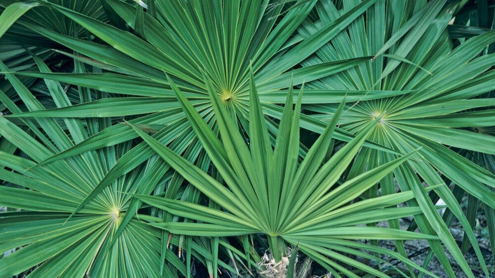

```{r, fig.align='center'}

```

### Summary:
This post explores how use the `Ggally` package to build and customize a `ggpairs` plot to explore multivariate correlations and relationships in a single figure. I learned how to convert variables to factors and complete binary logistic regression in R and present the regression output in a finalized table using the `kableExtra` package. I then used the `broom` package to find the actual counts and percentages of species that were correctly and incorrectly classified by the binary logistic regression output using a 50% cutoff.

I initially struggled with the customizing the ggpairs plot so I could easily read the correlation output and only keep variables of interest, but i learned how to customize the plot during this assignment. I also struggled to correctly or incorrectly classify the regression outputs based on the cutoff, but ended up using `mutate(case_when())` to create new columns based on the classifications. I then remembered I would use `janitor::adorn_percentages()` to add percentages to my table of counts. 

```{r setup, include=FALSE}
knitr::opts_chunk$set(echo = TRUE,
                      warning = FALSE,
                      message = FALSE)
library(tidyverse)
library(here)
library(GGally)
library(broom)
library(jtools)
library(kableExtra)
library(dplyr)
library(janitor)
```

### Reading in the Data & Initial Wrangling:
First, I read in the data. Then I used the `mutate(case_when())` function to rename the species to the full scientific name for the species. It is important to convert variables to a factor format before completing binary logistic regression, so I converted my new species column to factor form using the `as.factor` function.

```{r}
# Read in the data:
palmetto_data <- read.csv(here("data", "palmetto.csv"))

# Initial Data Wrangling:
palmetto_filter <- palmetto_data %>% 
  mutate(species_full = case_when(species == "1" ~ "Serenoa repens",
                                  species == "2" ~ "Sabal etonia")) %>%
  select(species_full, height, length, width, green_lvs)

#Covert species column to factor:
palmetto_filter$species_full <- as.factor(palmetto_filter$species_full)
```

### Preliminary Data Visualization Using `ggpairs`:
The ggpairs plot allows you to visualize multivariate correlations and relationships in a single figure to give a nice multivariate overview before preforming the regression analysis. I updated the color aesthetically to represent each species to see the differences between species.I learned how to select specific columns to keep in the final ggpairs plot using the `column` function and how to adjust the size of the text for the correlation matrices to make for a clearer presentation. 

```{r, fig.align = "center", fig.cap = "**Figure 1**: Pairs plot of multivariate correlations and relationships between independent variables to be used in the binary linear regression analysis. Exploration of relationships based on species - coral color represents the Sabal etonia species and teal color represents the serenoa repens species."}
# Make a ggpairs plot to explore relationships between variables: 
palmetto_filter %>% 
  ggpairs(aes(colour = species_full),
          columns = 2:5, # Select columns 2 through 5
          legend = 1, 
          upper = list(continuous = wrap("cor", size = 2)), #Adjust the size of the upper rows
          lower = list(continuous = 
                         wrap("smooth", alpha = 0.3, size = 0.1))) +
  theme(panel.grid.major= element_blank) + #remove panel grid lines 
  labs(title = "Multivariate Correlations & Relationships of Palmetto \n Height, Canopy Width, Canopy Height, and Number of Green Leaves",
       fill = "Palmetto Species") +
  theme_bw() +
  theme(plot.title = element_text(hjust = 0.5, size = 10)) 
```

There does not appear to be any large differences in species height, length, and width; however, Sabal etonia are slightly larger than Serenoa repens. Length, height, and width are highly correlated. Serenoa repens has a higher number of green leaves and green leaf number is more highly correlated to the other variables for this species. 

### Binary Logistic Regression Output:
Next, I completed a binary logistic regression using the `glm()` function with the dependent variable ~ sum of the independent variables and indicating I want R to complete a binomial regression using `family = "binomial"`. Then, using the `broom` package `tidy` function to create a tidy data frame of the regression output. I initially struggled with the p-values automatically rounding to 0, so I used mutate and case when to indicate the p-value is very small to not immediately round the values to 0 and store as 0.0001. I then create a finalized table using the `kableExtra` package for the regression outputs. 

```{r}
# Binary Logistic Regression:
palmetto_blr <- glm(species_full ~ height + length + width +green_lvs,
                            data= palmetto_filter,
                            family = "binomial") 

#Create a tidy data frame of the output:
tidy_blr <- broom::tidy(palmetto_blr) %>%
  mutate(p.value = case_when(p.value < 0.0001 ~ "0.0001")) %>% 
  rename(" " = term,
         Coefficient = estimate,
         "Standard Error" = std.error,
         Statistic = statistic,
         "P Value" = p.value) 

# Create a finalized table using the kableExtra package: 
  kbl(tidy_blr) %>% 
   kable_material(c("striped", "hover", full_width = F, position = "center"))
```
### Exploration of Model Success: 
Finally, using the `broom` package `augment` function to predict the probabilities of classification for each species based on the regression model. I then used a 50% cutoff and calculated counts and percentages for if the species would be properly or improperly classified by the regression model created above. 

**Table 1:** Table showing the actual counts and percentages of how many Palmetto were correctly and incorrectly classified as Serenoa Repens or Sabal etonia species by the Binary Logistic Regression model described above. Classification was determined using a 50% cutoff, meaning if the probability was greater than 50% that the species was Serenoa Repens then the species was classified as Serenoa repens. 

```{r}
# Use broom augment to find probabilities for each plant in the original dataset: 
palmetto_fitted <- palmetto_blr %>% 
  broom::augment(type.predict = "response") %>% 
  select(species_full, .fitted) %>% 
# Make a new column for which species the model predicts using a 50% cutoff:
  mutate(Model_classification = case_when(.fitted > 0.50 ~ "Serenoa Repens",
                                          .fitted < 0.50 ~ "Sabal etonia")) %>% 
# Make a new column for if the species was correctly or incorrectly classified based on this 50% cutoff: 
  mutate(Classification= case_when(species_full == "Serenoa repens" & Model_classification == "Serenoa Repens" ~ "Correct",
                                   species_full == "Serenoa repens" & Model_classification == "Sabal etonia" ~ "Incorrect",
                                   species_full == "Sabal etonia" & Model_classification == "Sabal etonia" ~ "Correct",
                                   species_full == "Sabal etonia" & Model_classification == "Serenoa Repens" ~ "Incorrect"))

# Make a table with Counts: 
palmetto_counts <- palmetto_fitted %>% 
  janitor::tabyl(species_full, Classification) 

# Make a table with proportions & actual counts:
palmetto_proportions <- palmetto_counts %>% 
#Add percentages to the columns: 
  janitor::adorn_percentages() %>% 
# Round the percentages to 2 digits: 
  adorn_pct_formatting(digits = 2) %>% 
# Keep the actual counts in the final table: 
  adorn_ns()

# Make a finalized table:
kbl(palmetto_proportions,
# Update the column names:
    col.names =c("", "Classified Correctly", "Classified Incorrectly")) %>% 
  kable_material(c("striped", "hover", full_width = F, position = "center")) 
```